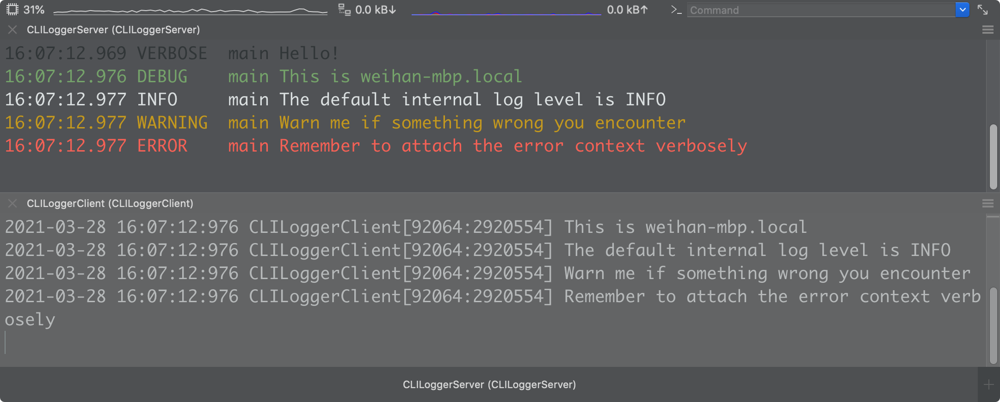
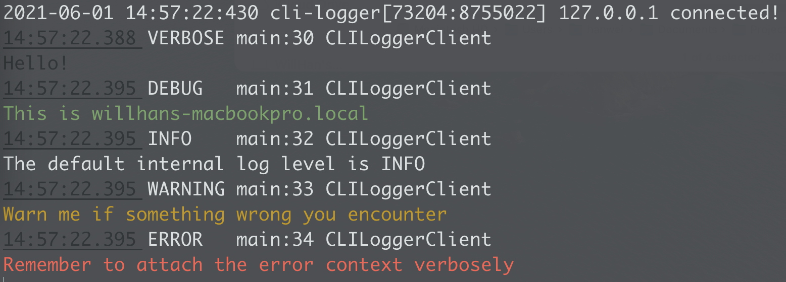
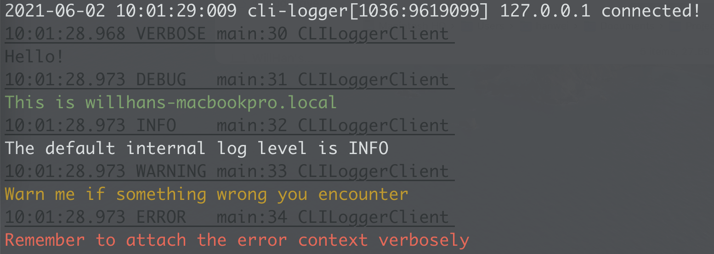
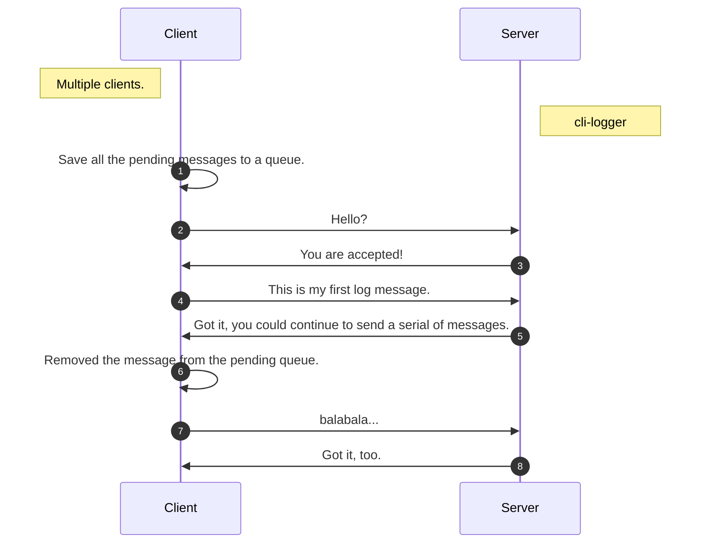

# CLILogger

A logging utility like [NSLogger](https://github.com/fpillet/NSLogger) but based on command line viewer.



## Server

Just download the executable file from release page and move to your prefer local environment paths with ease.

When running `cli-logger` at the first time, the default configuration file will be generated in `~/.config/cli-logger/default.plist` which will be used *in both current and future running session*, that is, `cli-logger` observes the configuration file changes in real time in its lifecycle.

```bash
➜  ~ cli-logger --help
USAGE: cli-logger [--verbose] [<service-name>] [--port <port>]

OPTIONS:
  --verbose               Show verbose logging of internal service or not.
  -s, --service-name <service-name>
                          The service name, defaults to current device host name.
  -p, --port <port>       The service port number, defaults to automatic.
  -f, --file <file>       Configuration file path, defaults to $HOME/.config/clilogger/default.plist.
  -h, --help              Show help information.
```


## Client

##### Installation

```ruby
pod 'CLILogger', :configurations => ['Debug'], :git => 'https://github.com/CLILogger/CLILogger', :branch => 'master'
```

> It still stays in alpha stage but it’s ready for common usages, I’ll be careful for `master`. :)


#### Usage

* Swift 

  ```swift
  import CLILogger
  
  DDLog.add(CLILogger.shared)
  ```

* Objective-C

  ```objective-c
  #import <CLILogger/CLILogger-Swift.h>
  
  [DDLog addLogger:CLILogger.sharedInstance];
  ```

`CLILogger` is built base on [CocoaLumberjack](https://github.com/CocoaLumberjack/CocoaLumberjack), you could use it as a common logger instance, this is also the recommended way. You could also forward your log messages to `CLILoggerClient` manually like this:

* Swift

  ```swift
  import CLILogger
  
  let client = CLILoggingClient.shared
  client.searchService()
  
  // Send log to server.
  client.log("This is \(Host.current().name ?? "a guest")")
  client.log("See", "you", "next", "time!")
  ```
  
* Objective-C

  ```objective-c
  #import <CLILogger/CLILogger-Swift.h>
  
  [CLILoggingClient.shared searchService];
  
  // Initialize entity object and send it to server.
  CLILoggingEntity *entity = [[CLILoggingEntity alloc] initWithMessage:@"Hello, world!" flag:DDLogFlagInfo module:[NSString stringWithFormat:@"%s", __FILE__]];
  [CLILoggingClient.shared logWithEntity:entity];
  ```

For diagnosing the internal service from client side, check out the `CLILoggingServiceInfo` class to trace the service status, same with server side:

```objective-c
CLILoggingServiceInfo.timeout = 3;
CLILoggingServiceInfo.logHandler = ^(DDLogLevel level, NSString *message) {
    printf("%s\n", message.UTF8String);
};
```

When starting to search the local logging bonjour service, make sure the logging service runs under the same local network with client.


## Configuration

In general, you may want to customize the colorful log message completely by yourself, check out the `Style` key in the configuration file, you could define the **foreground**, **background** and **style** for every log unit with these context keys:

* `{{Time}}`: log time generated by sender.
* `{{Flag}}`: log flag defined by `DDLogFlag`.
* `{{Filename}}`: filename which log generated in.
* `{{Line}}`: code line which log generated at.
* `{{Function}}`: function name which log generated in.
* `{{Message}}`: log message from sender.

Construct a prefer log message format under the key `Formatter` -> `Format`, if you need an additional time format for the value of `{{Time}}`, define it in `Formatter` -> `Time`.

Colorful log style reuses the above formatter context keys without double curly braces `{{` `}}`, besides, you could define a `Default` section key for all the context values as default. The values are referenced from its corresponding definitions:

* [ForegroundColor](https://github.com/onevcat/Rainbow/blob/master/Sources/Color.swift)
* [BackgroundColor](https://github.com/onevcat/Rainbow/blob/master/Sources/BackgroundColor.swift)
* [Style](https://github.com/onevcat/Rainbow/blob/master/Sources/Style.swift)

There are also some example configuration files for your consideration:

* [v1](./Resources/default-v1.plist)

  

* [v2](./Resources/default-v2.plist)

  


## Technology

`cli-logger` starts a tcp server with specified name and port for reading all the incoming clients’ arranged data (called `entity` internally), once receiving the data message from client, it will output the formatted message in console.

Try to discover the logging bonjour service via [Discovery for macOS](https://apps.apple.com/app/discovery-dns-sd-browser/id1381004916?mt=12), [Discovery for iOS](https://apps.apple.com/app/discovery-dns-sd-browser/id305441017) or `dns-sd`:

```bash
➜ dns-sd -B _cli-logger-server._tcp.
```

`CLILogger` in client side try to search the fixed tcp type in domain `local.`,  once the connection established successfully, it waits the log message when calling `log(:entity:)` of `CLILoggingClient`, note that there is a pending message queue inside used to cache the messages when *connection to logging service is not established*, they will be cleaned up one by one after the connection is available. Don’t doubt the message date you see in console output, that’s the time generated from client’s logger exactly.


#### Communication




#### Issues

For iOS 14, bonjour service on local network is disabled by default, adding the following keys to your client app target’s `Info.plist` makes it available, again.

```xml
<key>NSLocalNetworkUsageDescription</key>
<string>Looking for local TCP Logging Bonjour service</string>
<key>NSBonjourServices</key>
<array>
	<string>_cli-logger-server._tcp.</string>
</array>
```

Otherwise you will [get this error](https://developer.apple.com/forums/thread/653316):

````
["NSNetServicesErrorDomain": 10, "NSNetServicesErrorCode": -72000]
````


#### Differences [NSLogger](https://github.com/fpillet/NSLogger)

`CLILogger` loves [CLI](https://en.wikipedia.org/wiki/Command-line_interface), it receives the messages from client and pipe it to custom scripts whatever in macOS/*nix.

`CLILogger` is a big fans of `CocoaLumberjack`, too. It reuses the log flag/level definition of `CocoaLumberjack` and trace the internal logs inside. Besides, it’s so easy for iOS client app to integrate with `CocoaLumberjack`.


## Plan

#### Client

- [x] Support to choose logger service when multiple services in a same WLAN environment.

#### Server

- [x] Support to show client alias.
- [ ] Support to save and pipe the logging message to local file and other process.
  - [x] The full messages with verbose log level already save to predefined local file.
- [x] Custom the log color by log level in the config file.
- [x] Send the `reject` message to client before disconnecting.
- [x] Support to highlight the specified keywords.


## Dependency

* [CocoaAsyncSocket](https://github.com/robbiehanson/CocoaAsyncSocket)
* [CocoaLumberjack](https://github.com/CocoaLumberjack/CocoaLumberjack)
* [Rainbow](https://github.com/onevcat/Rainbow)


## License

[GPL](./LICENSE.txt)

